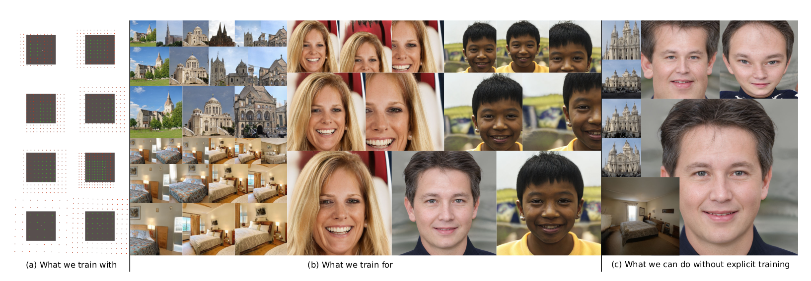
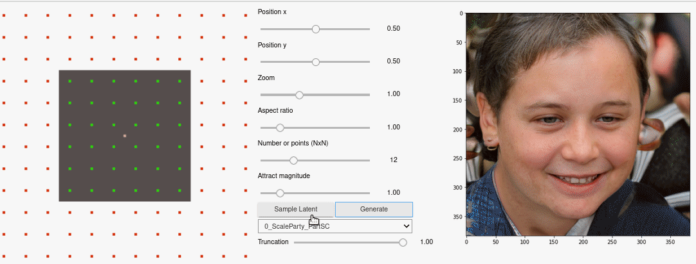

# Arbitrary-Scale Image Synthesis

[Paper](https://arxiv.org/abs/2204.02273) 



## Interactive Generation


You can experiment with the tool using the scaleparty.ipynb notebook.

## Arbitrary-Scale Image Synthesis samples 


## Installation 
This project was built upon the [mmgeneration](https://github.com/open-mmlab/mmgeneration) framework.

We use python 3.7.10, pytorch 1.8.1 and mmcv-full 1.3.3

You can use the conda environment in the _environment.yml_ file.

```
conda env create --file environment.yml
conda activate scaleparty
```

### In case of problem:
You may need to install mmcv-full from source, following the instructions [here](https://mmcv.readthedocs.io/en/latest/get_started/installation.html).

After installing mmcv-full, install the scaleparty flavor of mmgeneration by running the following inside the cloned folder:

```
pip install -v -e .
```

## Pretrained models

You can find the pretrained models [here](https://owncloud.csem.ch/owncloud/index.php/s/DREiMu9BktcGuS9).

## Training
Use the following command to train for multi-scale generation on FFHQ.

```
python -u -m torch.distributed.launch --nproc_per_node=8 --master_port=8899 tools/train.py configs/scaleparty/FFHQ_ScaleParty.py --launcher pytorch --work-dir path-to-workdir --cfg-options data.samples_per_gpu=4 
``` 

For our pretrained models, we started training with the ScaleParty-noSCFull configuration, and then fine-tuned for scale-consistency and partial training in order to reduce the computational cost.

## Creating the fid pkl for evaluation. 
First, use the resize.py script to resize the dataset to the required sizes for all evaluation calculations. This is important as it replicates the resizing procedure we deploy during training.

```
for size in `seq 256 64 512 `; do; echo "ffhq_"$size".pkl"; python tools/utils/inception_stat.py --imgsdir path-to-dataset/images"$size"x"$size" --size $size --pklname ffhq_"$size".pkl  --num-samples 50000; done
```

</code></pre>

### Citation

If you find this project useful in your research, please consider citing:

```BibTeX
@misc{ntavelis2022scaleparty,
  doi = {10.48550/ARXIV.2204.02273},
  url = {https://arxiv.org/abs/2204.02273},
  author = {Ntavelis, Evangelos and Shahbazi, Mohamad and Kastanis, Iason and Timofte, Radu and Danelljan, Martin and Van Gool, Luc},
  title = {Arbitrary-Scale Image Synthesis},
  publisher = {arXiv},
  year = {2022},
  copyright = {arXiv.org perpetual, non-exclusive license}
}

@misc{2021mmgeneration,
    title={{MMGeneration}: OpenMMLab Generative Model Toolbox and Benchmark},
    author={MMGeneration Contributors},
    howpublished = {\url{https://github.com/open-mmlab/mmgeneration}},
    year={2021}
}
```

## Acknowledgements
We would like to thank the following repos, their code was essential in the developement of this project:
- https://github.com/open-mmlab/mmgeneration
- https://github.com/rosinality/stylegan2-pytorch/


This work was partly supported by [CSEM](https://www.csem.ch) and the ETH Future Computing Laboratory (EFCL), financed by a gift from Huawei Technologies.
